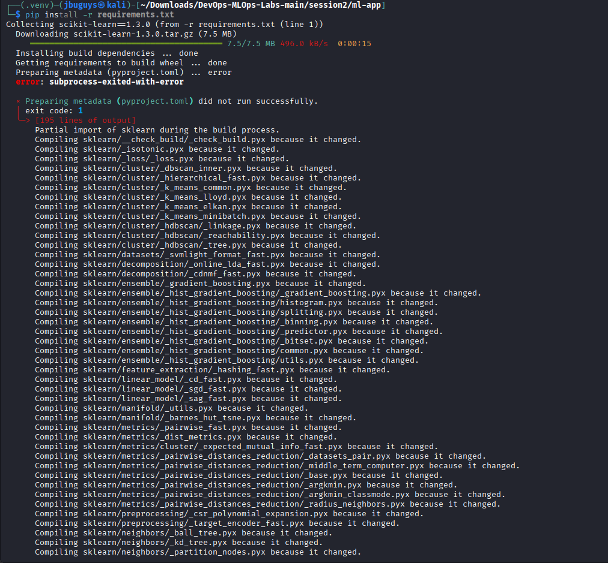
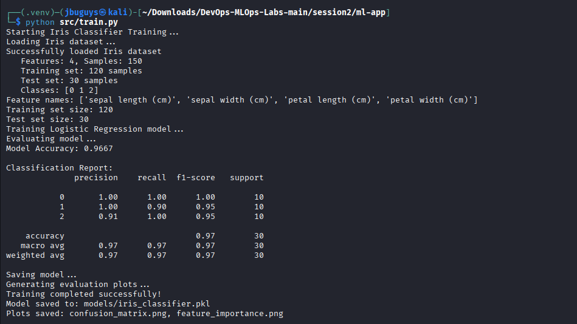
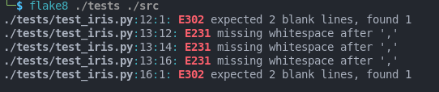
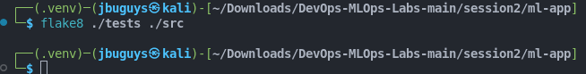
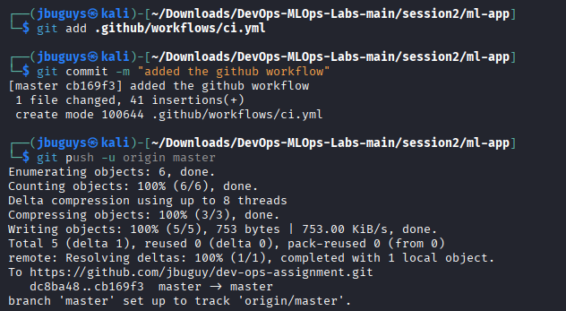
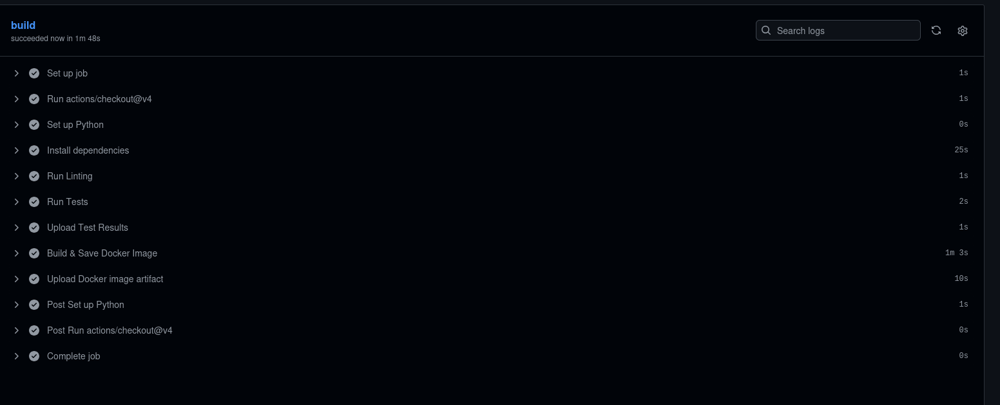
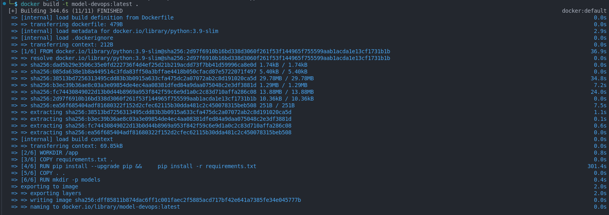
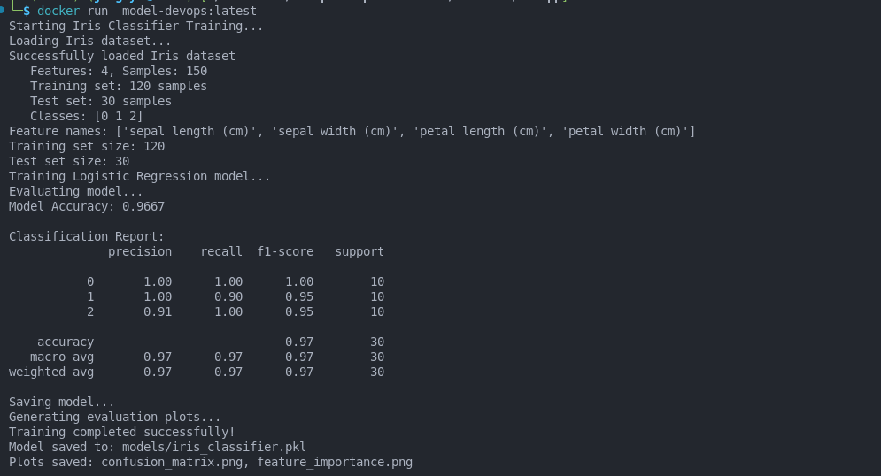

## Running the Application 

### create venv
```bash
python -m venv .venv
source .venv/bin/activate
```
### install required dependencies
```bash 
pip install -r requirements.txt
```

i use python version 3.13 on my local machine so i had to change the required versions of some libs as they only work with python 3.11
### run the app
```bash 
python src/train.py
```

## task 3
- test_load_data() – ensures the Iris dataset loads successfully and is not empty.

- test_model_training() – verifies that the IrisClassifier can train on sample data and sets the is_trained flag.

- test_model_prediction() – confirms the model can predict on new samples, checking both the number of predictions and their data types.
- test_data_shape() - confirm that the train data has 4 features.
```bash 

touch tests/__init__.py
pytest tests
```

## task 4 
```bash 
flake8 ./tests ./src
```


## task 5
creation of the workflow file
```bash 
mkdir -p .github/workflows
touch .github/workflows/ci.yml
```
push it to github


## task 6
create the docker file
build the docker image
```bash 
docker build -t model-devops:latest .
```

run the docker container locally 
```bash 
docker run model-devops:latest
```

## repo link 
- GitHub Repository: https://github.com/jbuguy/dev-ops-assignment
